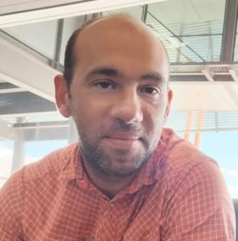
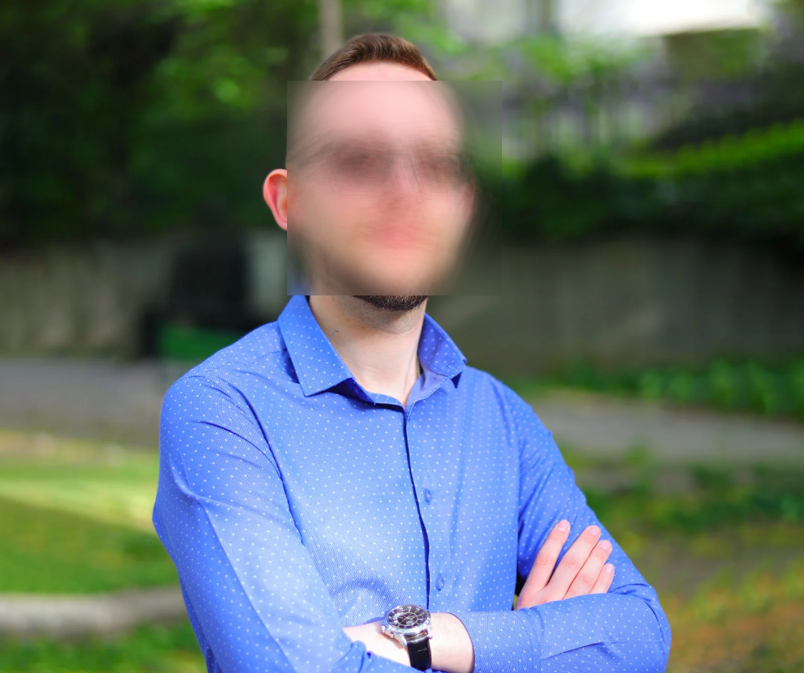
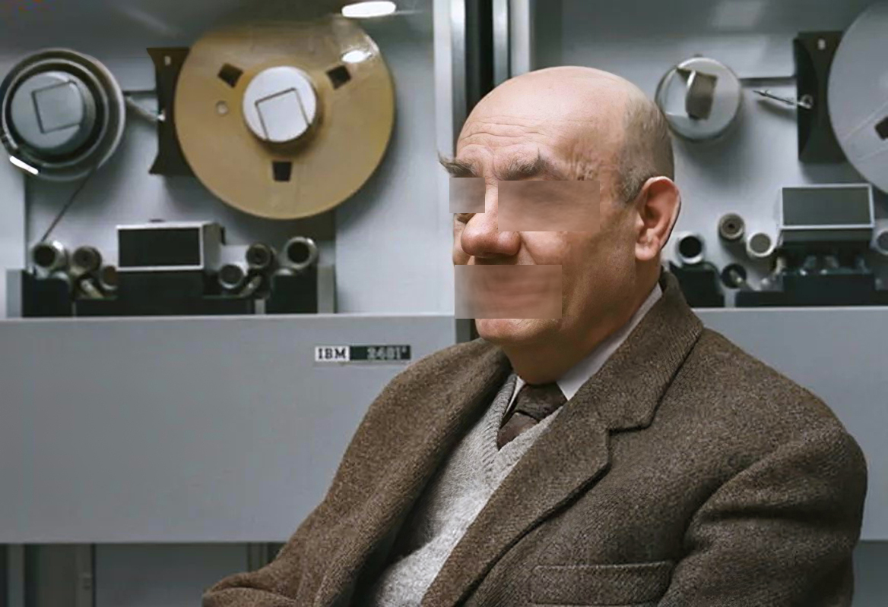
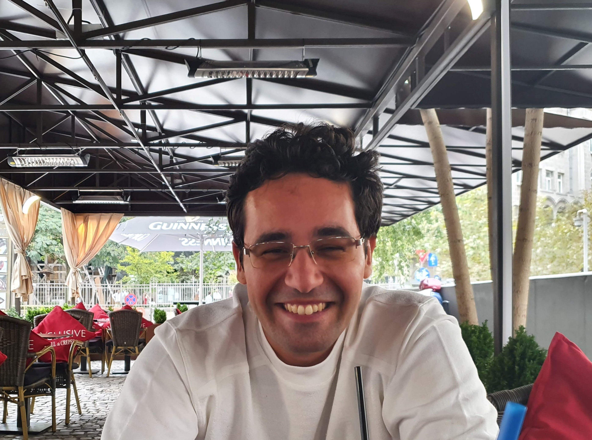
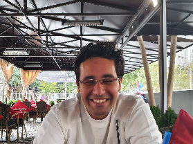
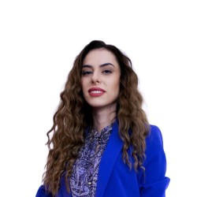
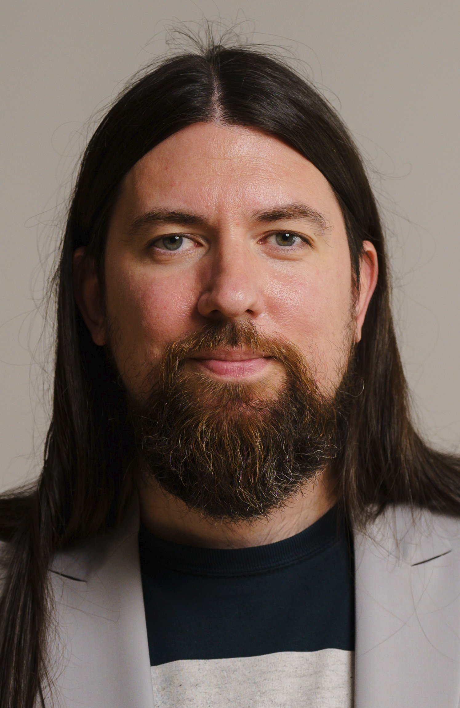
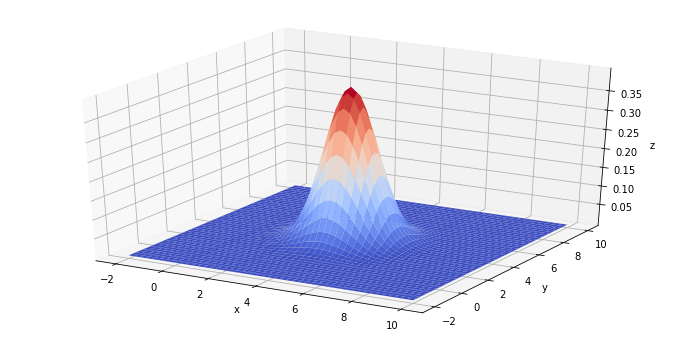

# Image_auto_modifier

Acesta este al doilea proiect la Probabilitati si Statistica, despre o simulare Monte Carlo.

## Disclaimer
Toate imaginile date ca exemplu sunt din domeniul public, luate de pe internet. 

## Ce face? 

Proiectul se bazeaza pe aplicarea unui filtru Gaussian pe o imagine in diferite moduri. 

- Cea mai simpla utilizare este de a-l aplica pe o imagine intreaga:
  
 Marius Dumitran Normal         |  Marius Dumitran Blurat
:-------------------------:|:-------------------------:
 | 

- Mai jos am folosit un neural network deja antrenat pe facial recognition, pentru a selecta bucati din imagini si a le aplica filtrul:

 Mihai Bucataru Normal        |  Mihai Bucataru Ascuns
:-------------------------:|:-------------------------:
 | 

- Cu acelasi model putem selecta si alte parti ale corpului: 

 Moisil Normal        |  Moisil Igrasiat
:-------------------------:|:-------------------------:
 | 

## Rularea
Dependentele se gasesc intr-un fisier din proiect si se pot importa ruland:

`pip install -r ./project/requirements.txt`

Pentru a modifica alte imagini, trebuie sa schimbati main-ul, corespunzand cu noua imagine si functia dorita.

## Echipa
Echipa este formata doar din grupa 252:

- Popescu Vladut-Daniel
    - leader
    - mare parte din logica codului
- Duzi Mihai-Nicolae
    - demonstratia teoretica
- Pescariu Matei-Alexandru
    - documentatia 

## Sa intram in paine!

### Coaja
- Pentru incarcarea si modificarea imaginilor am folosit modulul cv2 din pachetul numit *opencv*.
- Imaginile sunt salvate ca un np-array cu shape-ul (width, height, 3). Sunt practic o matrice cu elemente de tip (r, g, b), sau, mai corect, (b, g, r) :D  
- Putem accesa dimensiunile unei imagini folosind img.shape[0] si img.shape[1] respectiv. 

### Miezul

- Filtrul pe care l-am folosit are la baza o functie care genereaza perechi de coordonate 2D distribuite normal in jurul lui (0, 0), cu o anumita deviatie.
```py
def generate_norms(n, deviation):
    theta = np.random.random(n) * np.pi * 2
    r = -2 * np.log(np.random.random(n))

    x = np.multiply(np.sqrt(r), np.cos(theta)) * deviation
    y = np.sqrt(r) * np.sin(theta) * deviation

    return np.dstack((x, y))[0]
```

- Scopul final este sa parcurgem fiecare pixel din imagine, sa colectam coordonate din jurul lui (adaugandu-i normalele de mai sus), si sa-l egalam cu media lor:
```py
    for i in img.shape[0]:
        for j in img.shape[1]:

            # colectam si punctul in sine, in cazul in care nu gasim niciun alt punct
            points = [img[i, j]]

            # parcurgem normalele
            for norm in norms:
                ii = i + int(norm[0])
                jj = j + int(norm[1])
                
                # verificam daca coordonatele punctului nou sunt valide inainte de a-l colecta
                if 0 <= ii < img.shape[0] and 0 <= jj < img.shape[1]:
                    points.append(img[ii, jj])
        
            # setam punctul original ca media punctelor colectate
            new_img[i, j] = np.mean(np.array(points), axis = 0)
```

### Blurarea

- Acum, un apel simplu al acestui filtru arata asa:
```py
def smoothen(name, ext):

    # citim imaginea
    img = get_image(f"{name}.{ext}")

    # setam numarul de coordonate normale pe care vrem sa-l generam, si deviatia acestora
    # deviatie mai mare = imagine mai blurata
    # mai multe coordonate = acuratete si uniformitate mai bune

    img = apply_gauss(img, norm_count: 50, deviation: 6)

    # scriem si afisam imaginea noua 
    cv2.imwrite(f"assets/{name}_smoothened.png", img)
    cv2.imshow(name, img)
```
- Apeland aceasta functie putem sa bluram o imagine: 

Sorina Predut Normala             |  Sorina Predut Blurata
:-------------------------:|:-------------------------:
 | 


### Cum comprimam?
Am facut asta prin introducerea unui nou parametru, *compression* care stabileste scara de compresie aplicata asupra imaginii (daca ea este 400x400 si aplicam o compresie de 2, vom pastra doar 200x200 pixeli)
- Intern, generam noi liste de indexi de linii si coloane, reprezentand pixelii pe care ii vom pastra:
```py
    rows = np.linspace(0, img.shape[0]-1, int(img.shape[0]/compression), dtype=int)
    cols = np.linspace(0, img.shape[1]-1, int(img.shape[1]/compression), dtype=int)
``` 
- Acum, putem face o alta imagine de dimensiuni mai mici, iar trecerea din coordonatele ei (i, j) in coordonatele imaginii mari / initiale se va face cu rows[i], cols[j]
- Se modifica un pic iterarea prin pixeli, acum tinand cont de trecerea dintr-o dimensiune in alta: 

```py
    for i in range(len(rows)):
        for j in range(len(cols)):
            points = [img[rows[i], cols[j]]]

            for norm in norms:
                ii = rows[i] + int(norm[0])
                jj = cols[j] + int(norm[1])

                if 0 <= ii < img.shape[0] and 0 <= jj < img.shape[1]:
                    points.append(img[ii, jj])

            new_img[i, j] = np.mean(np.array(points), axis=0)
```
- Fara a aplica filtrul gaussian (deviatie 0) putem obtine:
  
 Andrei Sipos Normal - 1021 KB         |  Andrei Sipos Comprimat (Deviatie 0) - 131 KB
:-------------------------:|:-------------------------:
 | 

- Daca aplicam filtrul in timpul compresarii, obtinem:

 Andrei Sipos Normal - 1021 KB         |  Andrei Sipos Comprimat - 125 KB
:-------------------------:|:-------------------------:
 | 


### Se misca incet!
- Prima data cand filtram o imagine de 1000x1000px, dura 20-30 de secunde. Acum am redus timpul la 2-3 secunde cu ajutorul threadurilor (sau teoretic a proceselor multiple, interpretorul de python fiind fortat sa ruleze pe un singur thread mereu)
- Am alocat 12 threaduri (ar trebui sa fie maxim 2 pe cpu core), si am impartit lista de linii (rows) in 12 seturi de linii. Am creat un thread pentru fiecare set, avand scopul de computa pixelii de pe liniile setului respectiv. 

```py
    # cream seturile de linii
    lines = np.arange(0, len(rows))
    lines = np.array_split(lines, thread_count)

    threads = list()

    # cream un thread pentru fiecare set si il adaugam intr-o lista
    for line_set in lines:
        thread = mp.Process(target=apply_gauss_line_thread, args=(line_set, img, rows, cols, norms, mask,))
        threads.append(thread)
        thread.start()

    # asteptam sa se termine toate threadurile 
    for thread in threads:
        thread.join()
``` 

- Am creat si un spatiu de shared memory pentru a le permite threadurilor sa scrie partea lor din noua imagine
```py
    # in procesul principal

    a = np.empty(shape=(len(rows), len(cols), img.shape[2]), dtype=np.uint8)
    shm = shared_memory.SharedMemory(create=True, size=a.nbytes, name="img")
    new_img = np.ndarray(a.shape, dtype=a.dtype, buffer=shm.buf)

    ...

    # la final clonam imaginea local pentru a putea inchide shared memory-ul
    new_img2 = np.array(new_img)

    shm.close()
    shm.unlink()

    return new_img2
```
```py
    # pe thread

    existing_shm = shared_memory.SharedMemory(name='img')
    new_img = np.ndarray(shape=(len(rows), len(cols), img.shape[2]), dtype=np.uint8, buffer=existing_shm.buf)

    ...

    new_img[i, j] = np.mean(np.array(points), axis=0)

    ...

    existing_shm.close()
```

- Mai ales acum ca este si eficient, filtrul mai poate fi folosit si la imbunatatirea calitatii imaginilor in momentul in care le marim:
 
 Cezara Benegui Normala - 250 x 250 (11.5 KB)       |  Cezara Benegui Expandata - 2500 x 2500 (2.1 MB)
:-------------------------:|:-------------------------:
 | 

### Masti!
  Ultimul lucru de implementat este parametrul *mask*, care va fi un np.array bidimensional (aceleasi dimensiuni ca ale imaginii) cu valori de True si False. Practic, ii dam filtrului o masca care ii spune pe care pixeli sa ii computeze, si pe care sa ii lase cum sunt. Implementarea in filtru este evident banala. 
  
  - Masca este creata automat de openCV prin cascade Haar. Pe scurt, cascadele acestea sunt un algoritm rapid de detectare a unor obiecte (in cazul nostru fete, ochi) in imagini. Se numesc cascade pentru ca verifica in "cascada", adica mai intai general si apoi mai atent. [ce sunt cascadele (pe lung)?](https://pyimagesearch.com/2021/04/12/opencv-haar-cascades/)
  - Masca este implementata astfel:
```py
face_cascade = cv2.CascadeClassifier(cv2.data.haarcascades + "haarcascade_frontalface_default.xml")
eye_cascade = cv2.CascadeClassifier(cv2.data.haarcascades + "haarcascade_eye.xml")
mouth_cascade = cv2.CascadeClassifier(cv2.data.haarcascades + "haarcascade_smile.xml")

# o functie care primeste o anumita imagine si ii aplica un filtru peste o masca
# target ii zice ce sa puna in masca (e.g. "face", "eyes", "eyesmouth")

def hide_cascade(img, target, compression=1, norm_count=50, deviation=20):
    mask = np.full((img.shape[0], img.shape[1], 1), False)

    # pentru a aplica cascada este necesar sa convertim imaginea in greyscale
    gray = cv2.cvtColor(img, cv2.COLOR_BGR2GRAY)

    faces = face_cascade.detectMultiScale(gray, 1.2, 5)
   
    # parcurgem fetele detectate obtinandu-le bounding box-urile
    # (x, y) este coordonate la care incepe o fata, si w si h sunt lungimea si intaltimea ei

    for (x, y, w, h) in faces:

        # daca selectam toata fata, o marcam in masca si trecem mai departe
        if 'face' in target:
            mask[y:y + h, x:x + w] = True
            continue

        # cream slice-uri care sa corespunda portiunii curente (fata)
        face_roi = gray[y:y+h, x:x+w]
        mask_roi = mask[y:y+h, x:x+w]

        # selectam ochii
        if 'eye' in target:
            eyes = eye_cascade.detectMultiScale(face_roi, 1.2, 10)
            for (ex, ey, ew, eh) in eyes:
                mask_roi[ey:ey + eh, ex:ex + ew] = True

        # selectam gura 
        if 'mouth' in target:
            mouth = mouth_cascade.detectMultiScale(face_roi, 1.3, 10)
            for (ex, ey, ew, eh) in mouth:
                mask_roi[ey:ey + eh, ex:ex + ew] = True

    return apply_gauss(img, compression, norm_count, deviation, mask)
``` 
- aplicand masca pe ochi, putem genera:


 Paul Irofti Normal        |  Paul Irofti Fara Ochi
:-------------------------:|:-------------------------:
 | 

## OK, dar de ce functioneaza?
Simularea Monte Carlo facuta pentru generarea de norme foloseste o variabila normala si Unif(0,2pi).

 Graficul de mai jos este functia de densitate a variabilei aleatoare compusa din coordonatele carteziene.
  <br>


"Varful" functiei este punctul al carei medie vrem sa o calculam, iar dupa cum se poate vedea, cu cat este un punct mai aproape de varf, cu atat are sanse mai mari sa fie ales ca norma.


 Astfel, vor fi mai multe norme generate cu culori similare, rezultand intr-o **medie similara** cu culoarea initiala, dar si cu "culoarea teoretica" despre care vom vorbi putin mai tarziu. 


Combinand astfel fiecare pixel cu pixelii vecini, reusim sa **netezim** tranzitiile puternice dintre culori - similar cu exercitiul 1 din laboratorul 12 unde am avut de netezit un semnal dat de o combinatie de functii trigonometrice.


## Marja de eroare + Nivel de incredere 
 In mod evident, cu cat avem mai multe norme, cu atat imaginea este blurata mai bine. Dar de cate norme avem nevoie de exemplu pentru a avea o anumita marja de eroare cu un anumit nivel de incredere?

> Ce dorim:

 Intrucat o culoare a unui pixel este descrisa de 3 parametri independenti (r, g, b), putem determina de cate simulari este nevoie *astfel incat*: 

 - marja de eroare a uneia dintre culorile primare sa fie de maxim z= 32

 - cu un nivel de incredere de a= 80%.

 > Aflarea rezultatului:

Deoarece cantitatea unei culori primare este o variabila aleatoare marginita intre x = 0 si y = 255, putem folosi inegalitatea **Chernoff-Hoeffding**.

**Chernoff-Hoeffding** ne spune ca probabilitatea ca **diferenta absoluta dintre media teoretica si media empirica** (notata a) data de n simulari o sa fie mai mica decat un z>0 este mai mare decat 1-2e^(-2nz^2/(y-x)^2), care la randul sau e mai mare decat nivelul de incredere.

1-2e^(-2nz^2/(y-x)^2) > a

=> e^(-2nz^2/(y-x)^2) < (1-a)/2

=> 2nz^2/(y-x)^2 > -ln((1-a)/2)

=> n > -ln((1-a)/2) * (y-x)^2 / 2z^2

=> Inlocuim si obtinem n > ln(10) * 255^2 /1024 ~ 73. 


> Concluzie: Pentru ca la oricare din cele 3 componente ale unei culori sa avem garantat o marja de eroare de 32 cu un nivel de incredere de 80%, avem nevoie de 73 de norme. 

## Am terminat
Da, cam asta e tot.

## Pycharm?
Pe pycharm este posibil sa nu mearga instalat direct modulul cv2. [Solutie rapida](https://stackoverflow.com/questions/34365044/pycharm-does-not-recognize-cv2-as-a-module). 

## De incercat, am incercat
- Am incercat identificarea anumitor obiecte sau fete pe baza culorilor, in general folosind algoritmi [deltaE](https://en.wikipedia.org/wiki/Color_difference#CIELAB_%CE%94E*). Din pacate toate incercarile au esuat fenomenal. Printre altete, am obtinut: 


